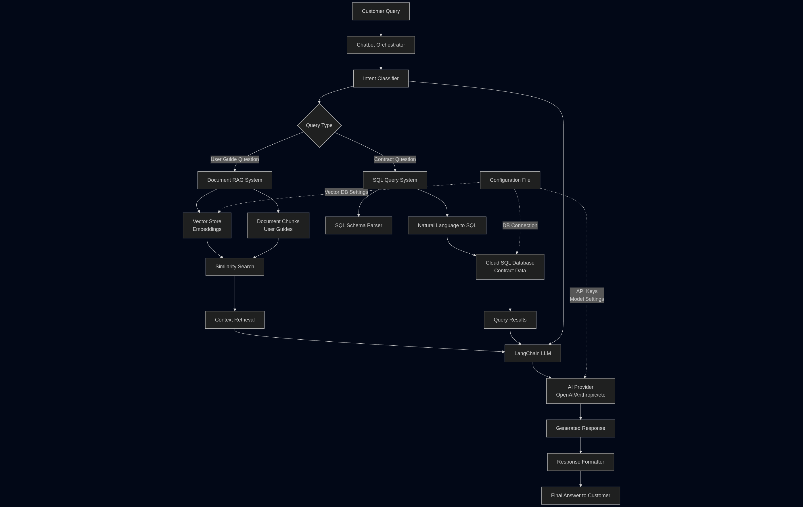
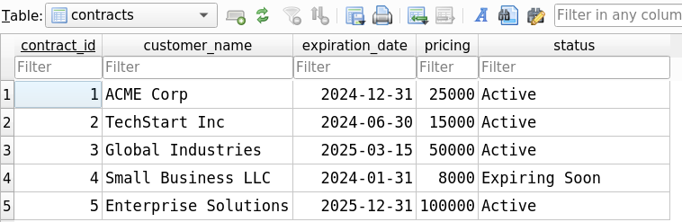
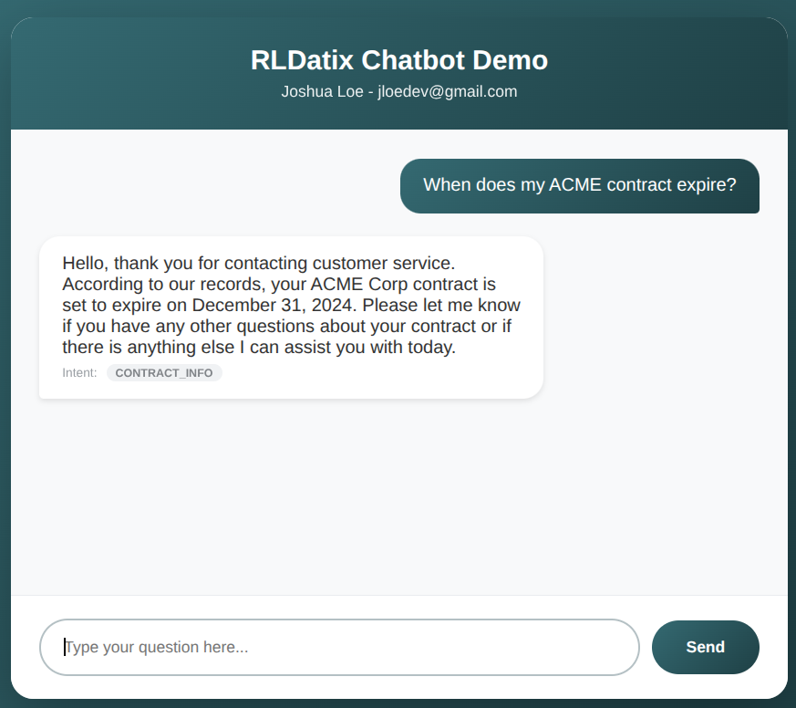

# RLDatix Chatbot Framework

An AI-powered chatbot framework built with LangChain, supporting multiple AI providers (OpenAI, Anthropic). The chatbot uses Retrieval Augmented Generation (RAG) for user guide questions and natural language to SQL conversion for contract-related queries.

## Quick Start

Get the chatbot running in 5 minutes:

```bash
# 1. Install dependencies
pip install -r requirements.txt

# 2. Set up environment variables
cp .env.example .env
# Edit .env and add your API key (OPENAI_API_KEY or ANTHROPIC_API_KEY)

# 3. Configure AI provider in config.yaml
# Set provider to "openai" or "anthropic"

# 4. Generate sample data
python setup_data.py

# 5. Start the web interface
python webapp.py
```

Visit **http://localhost:8080** to start chatting!

## Features

- Real-time chat web interface with REST API
- Multiple AI provider support (OpenAI, Anthropic)
- Retrieval Augmented Generation for documentation queries
- Natural language to SQL for contract information
- Intent classification and automatic query routing
- Conversation memory and context maintenance
- Flexible configuration through YAML
- Mock/demo mode for testing without external dependencies
- Safe SQL execution with read-only enforcement
- Interactive API documentation (Swagger UI)

## Architecture Overview



See `architecture.mmd` for the source diagram.

### Core Components

1. **Web Interface** (`webapp.py` and `static/index.html`)
   - FastAPI-based REST API server
   - Modern responsive chat interface with teal theme
   - Real-time messaging with typing indicators
   - API documentation with Swagger UI
   - Health check and status endpoints

2. **Configuration System** (`src/config_loader.py`)
   - Manages all configuration settings
   - Supports environment variable substitution
   - Flexible provider configuration for AI services

3. **RAG System** (`src/rag_system.py`)
   - Document loading and processing
   - Vector store management (ChromaDB or FAISS)
   - Similarity-based document retrieval
   - Supports multiple document formats (PDF, Markdown, HTML, Text)

4. **SQL Query System** (`src/sql_query_system.py`)
   - Natural language to SQL conversion
   - Safe query execution (read-only operations)
   - Support for PostgreSQL, MySQL, and SQLite
   - Mock mode for testing without database connection

5. **Chatbot Orchestrator** (`src/chatbot.py`)
   - Intent classification (keyword-based or LLM-based)
   - Query routing between RAG and SQL systems
   - Conversation memory management
   - Response generation using configured AI provider

### How It Works

1. **User submits a question** via web UI or API
2. **Intent Classification** - Keywords matched or LLM classifies query type
3. **Query Routing** - Routes to RAG system (user guides) or SQL system (contracts)
4. **Context Retrieval** - Retrieves relevant documents or executes SQL query
5. **Response Generation** - LLM generates natural language response with context
6. **Response Delivery** - Answer returned to user, conversation stored in memory

## Installation

### Prerequisites

- Python 3.8+
- pip package manager
- API key from OpenAI or Anthropic

### Setup Steps

1. **Install dependencies:**
```bash
pip install -r requirements.txt
```

2. **Set up environment variables:**
```bash
cp .env.example .env
```

Edit `.env` with your credentials:
```bash
# AI Provider Configuration
OPENAI_API_KEY=your_openai_api_key_here
ANTHROPIC_API_KEY=your_anthropic_api_key_here

# Database Configuration (optional for production)
DB_HOST=your_database_host
DB_NAME=your_database_name
DB_USER=your_database_user
DB_PASSWORD=your_database_password
```

3. **Configure AI provider in `config.yaml`:**
```yaml
ai_provider:
  provider: "openai"  # or "anthropic"
```

4. **Set up sample data:**
```bash
python setup_data.py
```

This creates:
- Sample user guide documents in `./data/user_guides/`
- Sample SQLite database at `./data/contracts.db`



The sample database includes 5 contracts with various customers, expiration dates, and pricing information.

5. **Configure database (optional):**

For SQLite (testing):
```yaml
sql_database:
  type: "sqlite"
  database: "./data/contracts.db"
```

For PostgreSQL/MySQL (production):
```yaml
sql_database:
  type: "postgresql"
  host: "${DB_HOST}"
  port: 5432
  database: "${DB_NAME}"
  username: "${DB_USER}"
  password: "${DB_PASSWORD}"
```

6. **Verify setup:**
```bash
python main.py check
```

You should see all components marked as [OK].

## Usage

### Web Interface (Recommended)



Start the web server:
```bash
python webapp.py
```

Open your browser:
```
http://localhost:8080
```

**Web Interface Features:**
- Beautiful, responsive chat interface with teal theme
- Real-time messaging with typing indicators
- Intent classification badges showing query routing
- Conversation history management
- Sample queries for quick testing
- System status monitoring

**API Documentation:**
```
http://localhost:8080/docs
```

### API Endpoints

- `POST /api/chat` - Send a message to the chatbot
- `GET /api/history` - Retrieve conversation history
- `POST /api/clear` - Clear conversation history
- `GET /api/status` - Get system component status
- `GET /health` - Health check endpoint

**Example API Usage:**
```bash
curl -X POST http://localhost:8080/api/chat \
  -H "Content-Type: application/json" \
  -d '{"message": "How do I export a report?", "use_llm_classification": false}'
```

### Command Line Interface

**Interactive Chat:**
```bash
python main.py interactive
# or simply
python main.py
```

**Run Examples:**
```bash
python main.py simple      # Simple examples
python main.py detailed    # Detailed query processing
python main.py check       # System health check
```

**Available Commands in Interactive Mode:**
- Type your question and press Enter
- `history` - View conversation history
- `status` - Check system status
- `exit` or `quit` - End session

### Programmatic Usage

```python
from src.chatbot import CustomerServiceChatbot

# Initialize chatbot
chatbot = CustomerServiceChatbot("config.yaml")

# Simple chat interface
response = chatbot.chat("How do I export a report?")
print(response)

# Detailed query processing
result = chatbot.process_query(
    "When does my contract expire?",
    use_llm_classification=True
)

print(f"Intent: {result['intent']}")
print(f"Answer: {result['answer']}")

# Check system status
status = chatbot.get_system_status()
print(status)
```

## Sample Queries

**User Guide Questions (RAG System):**
- "How do I add a new inventory item?"
- "How can I export a report?"
- "What are the steps to add a new user?"
- "How do I configure the reporting suite?"

**Contract Questions (SQL System):**
- "When does my contract expire?"
- "What modules have I purchased?"
- "What is my current pricing?"
- "When was the Inventory Management module purchased?"

**General:**
- "Hello, can you help me?"
- "What can you do?"

## Configuration

### AI Provider Configuration

Edit `config.yaml`:

```yaml
ai_provider:
  provider: "anthropic"  # or "openai"

  openai:
    api_key: "${OPENAI_API_KEY}"
    model: "gpt-4-turbo-preview"
    temperature: 0.7
    max_tokens: 2000

  anthropic:
    api_key: "${ANTHROPIC_API_KEY}"
    model: "claude-3-opus-20240229"
    temperature: 0.7
    max_tokens: 2000
```

### Vector Store Configuration

```yaml
vector_store:
  type: "chromadb"  # or "faiss"
  persist_directory: "./data/vector_db"
  collection_name: "user_guides"
  embedding_model: "sentence-transformers/all-MiniLM-L6-v2"
  chunk_size: 1000
  chunk_overlap: 200
```

### Intent Classification Keywords

Customize keywords in `config.yaml`:

```yaml
intent_classification:
  user_guide_keywords:
    - "how to"
    - "how do I"
    - "tutorial"
    - "guide"
    - "instructions"
    - "steps"

  contract_keywords:
    - "contract"
    - "expiration"
    - "pricing"
    - "modules purchased"
```

## Technical Details

### Design Decisions

**Modular Architecture:**
- Each component (RAG, SQL, Config, Chatbot) is separated into its own module
- Allows independent testing, maintenance, and extension
- Components communicate through well-defined interfaces

**Configuration-Driven:**
- All settings externalized in `config.yaml`
- Environment variables for sensitive data
- Easy to switch between AI providers without code changes
- Mock mode for testing without external dependencies

**RAG System:**
- Documents split into chunks (1000 chars) with overlap (200 chars)
- Embeddings generated using sentence transformers
- Vector similarity search for relevant document retrieval
- Supports ChromaDB (persistent) and FAISS (fast)

**SQL System:**
- Natural language to SQL using LangChain
- Read-only queries enforced (SELECT only)
- SQL injection prevention through validation
- Mock mode generates sample data for testing

**Intent Classification:**
- Keyword-based (fast, no API calls)
- LLM-based (accurate, handles ambiguous queries)
- Configurable routing keywords

### Scalability Considerations

**Current Implementation:**
- Single-threaded synchronous processing
- Suitable for moderate traffic (< 100 concurrent users)
- Vector store loaded in memory

**Production Scaling Options:**
1. Add Redis for distributed caching
2. Use async processing for concurrent requests
3. Implement request queuing (Celery, RabbitMQ)
4. Deploy vector store as separate service
5. Load balance across multiple instances
6. Use database connection pooling

### Performance Optimization

**Vector Search:**
- FAISS is faster for large document collections
- Consider approximate nearest neighbor for speed
- Index optimization based on dataset size

**Caching:**
- Cache frequent queries and responses
- Store embeddings to avoid recomputation
- Cache database query results with TTL

**Database:**
- Index frequently queried columns
- Use read replicas for query distribution
- Implement query result caching

### Security

**Data Protection:**
- API keys in environment variables
- Database credentials never in code
- SQL injection prevention through validation
- Read-only database access enforced

**Input Validation:**
- Query length limits
- Unsafe SQL operation blocking
- Rate limiting (recommended for production)
- Input sanitization

## Project Structure

```
rldatix/
├── architecture.mmd              # Architecture diagram
├── config.yaml                   # Configuration file
├── .env                          # Environment variables (not in repo)
├── .env.example                  # Environment template
├── requirements.txt              # Python dependencies
├── webapp.py                     # Web UI server (recommended)
├── main.py                       # CLI entry point
├── demo.py                       # Demo script
├── setup_data.py                 # Sample data generator
├── rebuild_vectorstore.py        # Vector store rebuild utility
├── README.md                     # This file
├── src/
│   ├── __init__.py              # Package initialization
│   ├── config_loader.py         # Configuration management
│   ├── rag_system.py            # RAG implementation
│   ├── sql_query_system.py      # SQL query handling
│   └── chatbot.py               # Main orchestrator
├── static/
│   └── index.html               # Web UI interface
└── data/
    ├── user_guides/             # User guide documents
    ├── vector_db/               # Vector store persistence
    └── contracts.db             # SQLite database (sample)
```

## Troubleshooting

**No API key error:**
- Set OPENAI_API_KEY or ANTHROPIC_API_KEY in `.env` file
- Restart your terminal after editing `.env`

**Database connection failed:**
- System will use mock data if database unavailable
- Check database credentials in `.env`
- Use SQLite sample database for testing

**No documents loaded:**
- Run `python setup_data.py` to create sample documents
- Or add your own documents to `./data/user_guides/`
- Ensure documents are in supported formats (.txt, .pdf, .md, .html)

**Import errors:**
- Install all dependencies: `pip install -r requirements.txt`
- Use Python 3.8 or higher
- Consider using a virtual environment

**Vector store initialization failed:**
- Ensure write permissions for `./data/vector_db/` directory
- Run `python rebuild_vectorstore.py` to recreate vector store

**Port already in use:**
- Change port in `webapp.py` (default: 8080)
- Or kill existing process on port 8080

## Extensibility

The framework is designed to be easily extended:

1. **Add new AI providers** - Implement in `_initialize_llm()` method in `src/chatbot.py`
2. **Add new vector stores** - Add cases in RAG system initialization
3. **Add new document formats** - Add loaders in `_load_single_document()` in `src/rag_system.py`
4. **Customize intent classification** - Modify keywords in config or implement custom classifier
5. **Add new query types** - Extend IntentType enum and add handlers in orchestrator
6. **Add analytics** - Track queries in `process_query()` method

## Built With

- **LangChain** - Framework for LLM applications
- **OpenAI / Anthropic** - AI model providers
- **ChromaDB / FAISS** - Vector databases
- **SQLAlchemy** - SQL toolkit
- **Sentence Transformers** - Embedding models
- **FastAPI** - Web framework for API
- **Uvicorn** - ASGI server

## Tips

- Start with sample data to test functionality
- Use keyword classification for faster responses
- Enable conversation memory for better context
- Monitor token usage with OpenAI/Anthropic dashboards
- Adjust chunk size in config.yaml based on your documents
- Use SQLite for testing, PostgreSQL/MySQL for production
- Review API documentation at http://localhost:8080/docs for integration
- Check logs for debugging query routing and intent classification

## Author

Joshua Loe - jloedev@gmail.com
